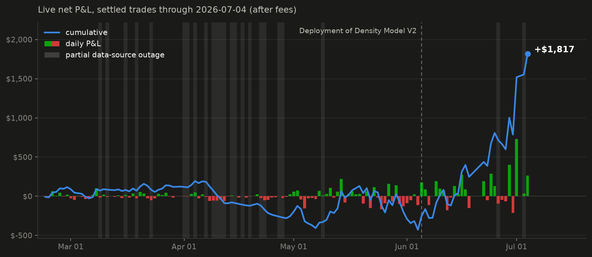
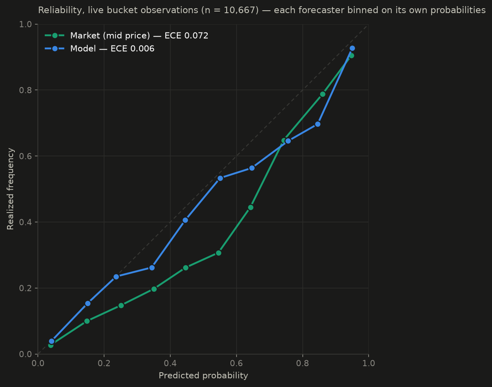
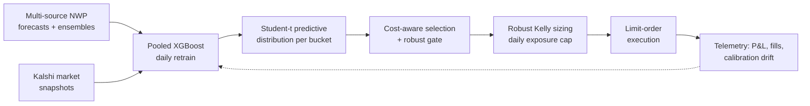

# Systematic Exploitation of Inefficient Prediction Markets

## Overview

Kalshi's daily maximum-temperature markets systematically misprice forecast
uncertainty. This repository documents a fully autonomous trading system built
against that mispricing. Live since February 22, 2026. (Metrics as of July 3rd, 2026)

Across 1,000+ settled trades, the system has a lifetime Sharpe of 2.0
(annualized from daily returns on deployed capital, net of fees). The current
model version, deployed June 5, returned **+37.4% on deployed capital in its
first month**, net of fees, and prices contracts measurably better than the
market: **10.3% Brier skill** and **12× lower calibration error** against
market-implied probabilities (details below).. 

## Live Trading Performance

*Settled trades only, P&L net of Kalshi fees. Data as of 2026-07-03, refreshed routinely.*

### Performance Summary

The vertical markers are two major strategy modifications: the risk layer
(cost-aware selection + robust gates, late May) and the current pooled density
model with ensemble-conditional σ (June 5). Everything to the right of a marker
is out-of-sample for that version. Each improvement was synthesized and backtested on historical
data.

| Metric | Lifetime (since Feb 22) | Current model (since Jun 5) |
|---|---|---|
| Settled trades | 1,014 | 179 |
| Net P&L (after fees) | +$1,519 | +$1,947 |
| Return on risk | +11.7% | **+37.4%** |
| Win rate (settled) | 30.4% | 43.6% |
| Avg win / avg loss | 2.7× | 2.1× |
| Profit factor | 1.17 | 1.62 |
| Sharpe (annualized) | 2.0 | - |

*Sharpe is computed on daily returns over capital deployed that day, √365
annualization; the current-model window is too short to annualize honestly.
Lifetime fees paid: $488*

| Month | Settled | Net P&L | Win % |
|---|---|---|---|
| Feb | 56 | +$116 | 37.5% |
| Mar | 219 | +$7 | 28.3% |
| Apr | 245 | −$377 | 20.8% |
| May | 296 | +$56 | 31.1% |
| Jun | 189 | +$986 | 41.8% |
| Jul | 9 | +$732 | 33.3% |

These are capacity-constrained retail markets: absolute P&L is small by
construction, and the system is judged on forecast quality, cost-aware
selection, and risk process rather than dollar totals.

### Model vs. market, measured live

The system snapshots every bucket of every city's market daily,
traded or not, alongside the model's predicted distribution. Scoring model
probabilities against market mid prices over the full live window
(**10,757 bucket observations**, 129 days, 20 cities):

- **Brier skill score: +10.3%** vs. the market (Brier 0.091 vs. 0.102)
- **Expected calibration error: 0.006 vs. 0.072 — 12× lower**, each forecaster
  binned on its own probabilities (10 bins, count-weighted)

## Validation

The model is retrained every day with a training window ending yesterday,
both in production and development. Strategy changes are validated on a daily-retrain
walk-forward backtest engine maintained in parity with the live trading code
(selection, cost model, sizing) before any deployment. Nothing ships on
static-fit results: several statically-promising features and distributional
changes were rejected because their gains did not survive walk-forward
evaluation.

Costs are modeled explicitly, the Kalshi taker fee and a limit-price slippage
budget are netted from every candidate's edge before it is thresholded, and
sizing prices at the realized fill price. Selection requires both a
net-of-cost edge and a distributionally robust gate that shrinks the model
probability toward the market price before applying a KL worst-case haircut
(Lam 2016); sizing is robust Kelly under a daily exposure cap, with the
ambiguity radius set from the forecaster's own calibration diagnostics. The
live system logs fills, gate decisions, and PIT/coverage calibration drift
daily.

Earlier per-city model versions were validated with parameter sweeps and Monte
Carlo stress tests before capital was deployed (Jan–Feb 2026); the pooled
system deployed June 5 supersedes them. Full validation results will accompany
a paper planned for fall 2026.

## System

Python · XGBoost · SciPy · pandas · BigQuery + S3 data feeds · deployed on a
VPS with daily automated execution. A six-tab Dash/Plotly dashboard
(performance, model diagnostics, model internals, market diagnostics, trade
diagnostics, daily snapshot) monitors the live system.

## Limitations & Disclosure

- **Observation windows:** Daylight Savings shifts the NWS observation window
  by an hour, which mainly matters in early spring when the daily high can
  print near midnight.
- **Liquidity:** Kalshi temperature volume ($10K–$500K per city-day, variable)
  constrains position size and scalability; the system scales horizontally as
  platforms add cities rather than vertically in existing books.
- **Edge decay:** As these markets attract informed participants, the
  mispricing should compress; the live record above is the relevant evidence,
  not a guarantee.
- **Execution:** Fills cross the spread with a slippage budget; results in
  thinner books may differ from the record above.

Production thresholds, parameter values, and execution scheduling are
intentionally withheld; the results above are insensitive to them. Source code
is private due to live deployment. I'd be happy to walk through the full methodology
in a technical discussion.
