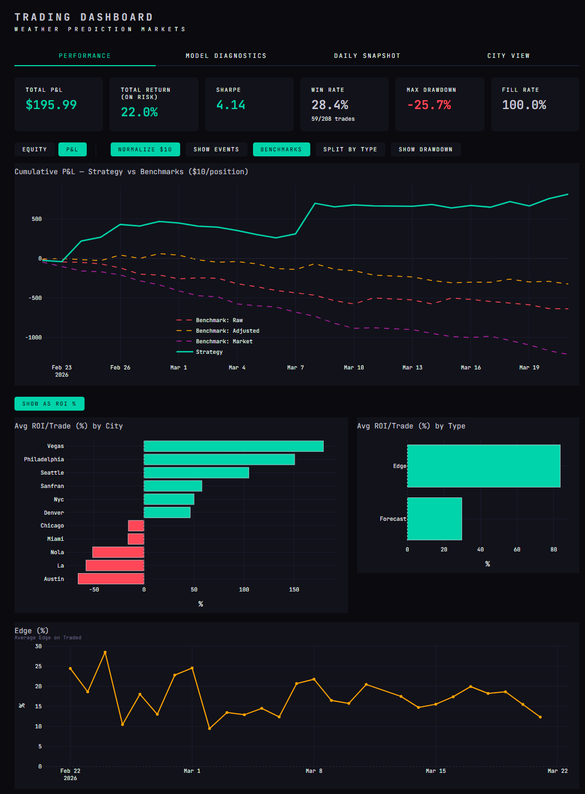
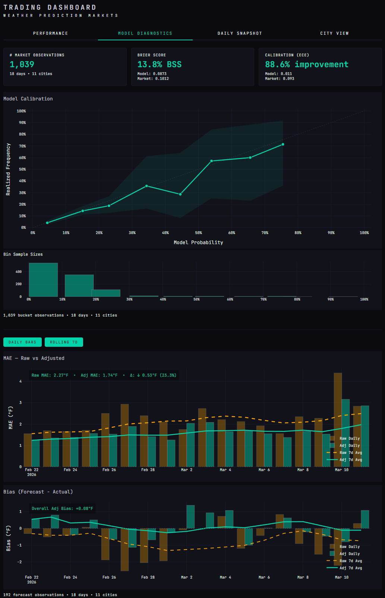
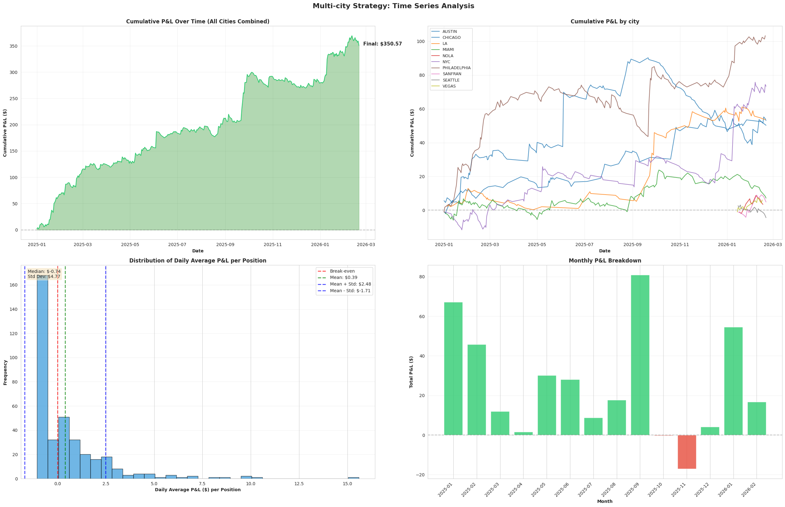
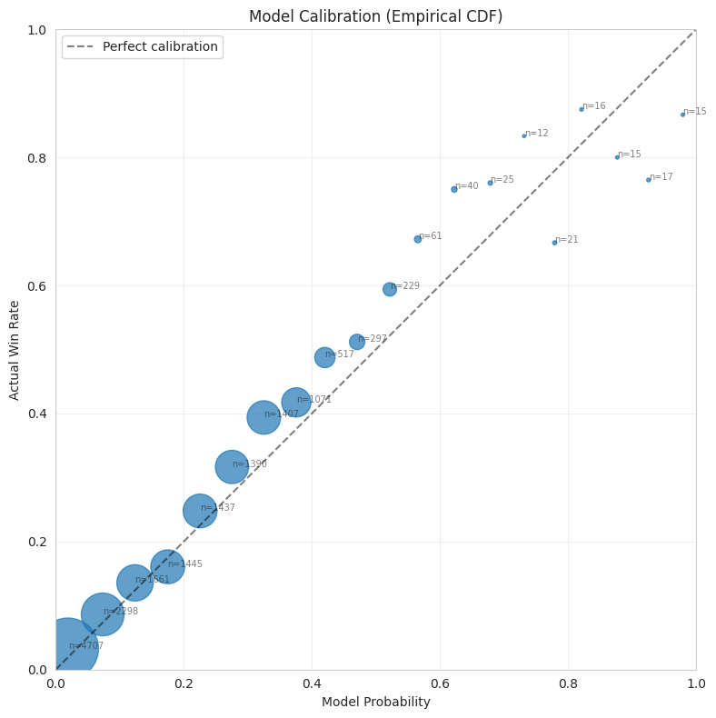
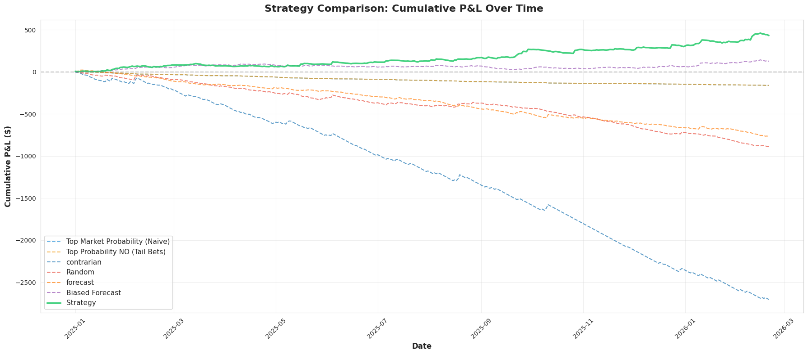
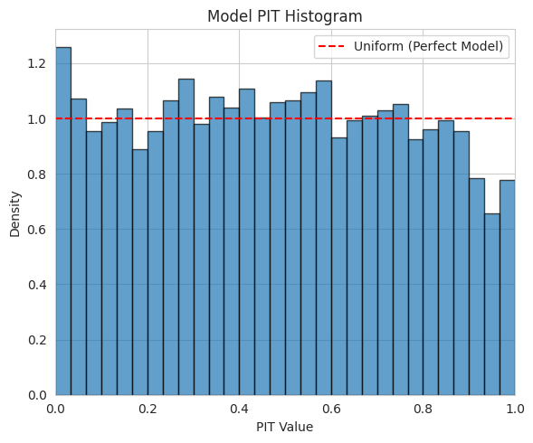
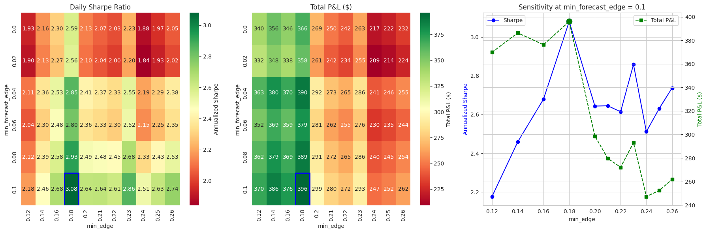
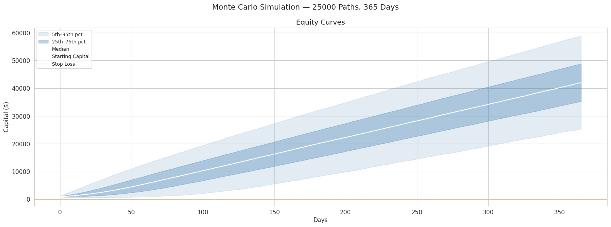
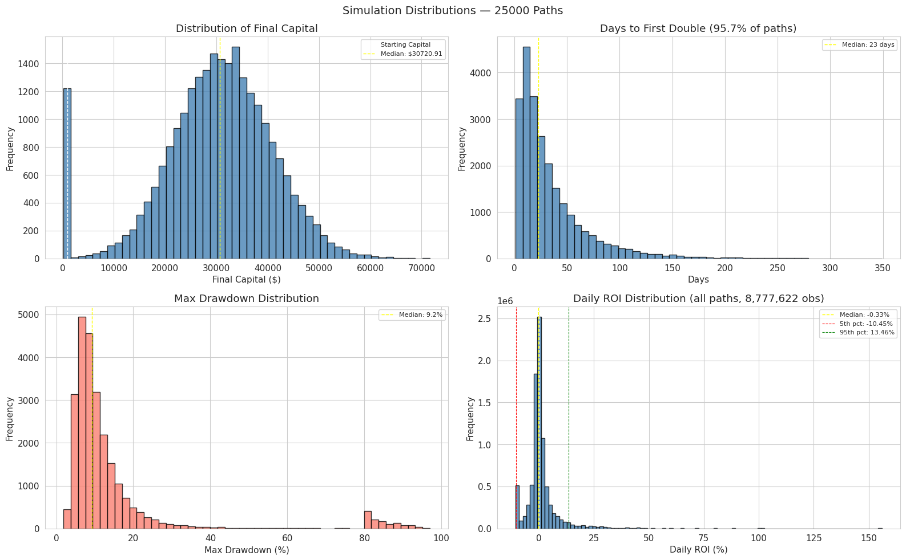

# Systematic Exploitation of Inefficient Prediction Markets

## Overview

Kalshi temperature markets consistently and systematically misprice the forecast uncertainty of maximum temperature outcomes. Analysis of 1,911 city-date observations reveals that market-implied uncertainty exceeds realized uncertainty by a factor of 1.27x.

This strategy trades binary outcome contracts by generating calibrated probability estimates for each temperature bucket and comparing them against live market prices to identify mispriced positions across 10 U.S. cities. The probability model: A boosted decision tree, trained on 30 features derived from multiple independent weather data sources and Kalshi market microstructure, predicts the forecast error distribution for each city-date. 

## Live Trading Performance

The strategy has been deployed in its current state since 2026-02-22 (earlier versions have been trading since January).

### Performance Summary (As of 2026-03-22)

### Model Diagnostics

## Backtest Results (Out-of-Sample)

**Period:** 2025-01-01 to 2026-02-20 | **Sizing:** $1 per trade | **Fees:** Kalshi fee formula + $0.02 spread assumption

| Metric | Value |
|--------|-------|
| Trades | 1012 |
| Total Return | 49.8% |
| Daily Sharpe (ann.) | 4.9 |
| Max Drawdown | 5.6% |
| Win Rate | 34.9% |
| W/L Ratio | 3.2 |
| Profit Factor | 1.72 |
| Calmar Ratio | 15.1 |

### Equity Curve

### Model Calibration

The model's predicted probabilities align closely with empirical outcomes across 16,681 out-of-sample markets. When the model assigns probability *p* to a bucket, it resolves YES approximately *p* of the time, across all probability bins.

### Benchmark Comparison

Every naive and baseline strategy yields negative returns over the same period. The model outperforms the best profitable baseline by **1.93x P&L** and **1.96x Sharpe**. The best profitable baseline uses the same underlying model to adjust forecasts, but trades every available forecast without selectivity, demonstrating trade selection and mispricing identification as critical as the model itself.

| Strategy | Trades | Win% | Total P&L | Sharpe | Max DD |
|----------|--------|------|-----------|--------|--------|
| **This Strategy** | 1,012 | 34.9% | $503.7 | 4.9 | $-29.36 |
| Best Baseline | 2,547 | 48.4% | $261.0 | 2.5 | $-42.77 |
| Naive Forecast | 2,504 | 25.9% | $-787.95 | -7.0 | $-810.86 |
| Random | 4,143 | 49.7% | $-905.35 | -6.96 | $-905.42 |

### Statistical Evaluation

**Distributional Calibration (PIT Test)**

The use of the Probability Integral Transform, following the evaluation framework of Diebold et al. (1998), assesses whether the model's predicted distributions match the true data-generating process. If calibrated, CDF(actual) should be uniformly distributed. The model's PIT histogram is approximately uniform with slight overdispersion (KS=0.033, indicating well-calibrated distributional forecasts.

**Predictive Accuracy (Diebold-Mariano Test)**

The Diebold-Mariano (1995) test compares paired Brier scores between the model and market implied probabilities. On all buckets, the market is more accurate overall (DM=4.17, p<0.001, N=17,275). On traded buckets specifically, the model significantly outperforms the market (DM=−2.77, p=0.006), confirming that the trade selection mechanism identifies genuine mispricings rather than noise.

| Subset | Model Brier | Market Brier | DM Stat | p-value |
|--------|-------------|--------------|---------|---------|
| All Buckets | 0.128 | 0.124 | 4.17 | <0.001 |
| Traded Buckets | 0.201 | 0.214 | −2.77 | 0.006 |

### Trading Parameter Robustness

A sweep of **66 parameter configurations** shows that **all are profitable**, with annualized Sharpe ratios ranging from 3.44 to 5.03. The chosen parameters rank #2 by composite score but sit near the center of the profitable region rather than on a boundary.

### Monte Carlo Simulation

25,000 forward paths simulated with conservative assumptions including win degradation (5% flip probability, simulating edge decay and/or model degradation), daily exposure caps, and stop-loss triggers.

| Metric | Value |
|--------|-------|
| Median Sharpe (ann.) | 3.16 |
| Profitable Paths | 99.1% |
| Mean Max Drawdown | 7.5% |
| Stop Loss Hit | 0.9% |

## Limitations

- **Time Shifts:** Daylight Savings Time shifts the NWS observation window by one hour, which mainly affects early spring, as the maximum temperature can be observed near midnight. The current backtest does not account for this.
- **Liquidity:** Kalshi temperature market volume, ranging between $10K–$500K per city per day (variable), constrains scalability, especially for newer cities.
- **Edge decay:** As markets attract more informed participants, the mispricings will likely compress.
- **Execution:** Backtest uses historical ask prices + spread; live limit order fills may differ in thinner markets.

## Scalability

The strategy scales horizontally as Kalshi adds cities. New cities plug directly into the existing pipeline with no architectural changes. Minimum temperature markets and other prediction market platforms could further expand the opportunity set. Polymarket currently has 82 cities, while Kalshi only hosts 21. Although, Polymarket is still unavailable in the U.S. for these markets.

## Tech Stack

Python · XGBoost · Kalshi API · BigQuery · VPS

---

*Source code is private due to live deployment; happy to walk through the full methodology in a technical discussion.*
